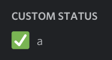

# BetterDiscord-Animated-Status

<!-- vim-markdown-toc GFM -->

* [Installation](#installation)
* [Usage](#usage)
* [Timeout / Time Per Keyframe](#timeout--time-per-keyframe)
* ['rich' vs 'raw' editor](#rich-vs-raw-editor)
* [Animations](#animations)
* [Examples](#examples)
* [Discord Nitro Emoji](#discord-nitro-emoji)
	* [Custom Javascript](#custom-javascript)

<!-- vim-markdown-toc -->

## Installation
Install [BetterDiscord](https://github.com/rauenzi/BetterDiscordApp)\
Download [animated-status.plugin.js](/animated-status.plugin.js?raw=true) into the following directory\
Mac: `~/Library/Preferences/BetterDiscord`\
Windows: `%appdata%\BetterDiscord\plugins`\
Linux: `~/.config/BetterDiscord/plugins`

## Usage
Open Discord, go to Settings\>Plugins, enable AnimatedStatus and click on Settings.\
Enter the required information into the input fields and click `save`

## Timeout / Time Per Keyframe
The value specifies the length of each animation step in milliseconds.
Example: With a timeout of 2000, the following animation would take 4 seconds to complete
```
"abc"
"def"
```
The animation timeout should be at least 2900 milliseconds for the animation to look smooth on other clients. This makes sure no keyframe gets gets lost.
On mobile systems the timeout might have to be set a little higher (10-14 Seconds)\
^ According to [@pintoso](https://github.com/pintoso)

## 'rich' vs 'raw' editor
Since the lastest version, the plugin now features a new rich editor. It doesn't add functionality, but makes editing your animations a whole lot easier!\
\
The raw editor is just a text input field, where you can edit your animations manually in a json-like format\
(looking at the source code reveals that it's basically json with missing brackets)

## Animations
\
Animations are made in a really simple and easy to understand syntax.
```
"Test (Message)"
"Test (Message)", "👍 (Symbol)"
"Test (Message)", "emoji (Nitro Symbol)", "000000000000000000 (Nitro Symbol ID)"
"eval new String('test') (Javascript)"
"eval new String('test') (Javascript)", "eval new String('👍') (Javascript)"
...
```
## Examples
Switching text:
```
"Text 1"
"Text 2 with emoji", "👍"
```

## Discord Nitro Emoji
- Open a discord Chat, type `\`.

- Select the emoji you want to include in your status using the emoji picker.

- Notice that the message changed to `<:emojiname:emojiid>`. The values inside the brackets (emojiname and emojiid) are the values required for the status.

- Edit the settings accordingly


### Custom Javascript
Have the current time as your status:
```
"eval let fmt=t=>(t<10?'0':'')+t;let d=new Date();`${fmt(d.getHours())}:${fmt(d.getMinutes())}:${fmt(d.getSeconds())}`;"
```

Have the current time with the corresponding clock symbol as your current status

```
"eval let fmt=t=>(t<10?'0':'')+t;let d=new Date();`${fmt(d.getHours())}:${fmt(d.getMinutes())}:${fmt(d.getSeconds())}`;", "eval ['🕛','🕐','🕑','🕒','🕓','🕔','🕕','🕖','🕗','🕘','🕙','🕚'][((new Date()).getHours()%12)];"
```
