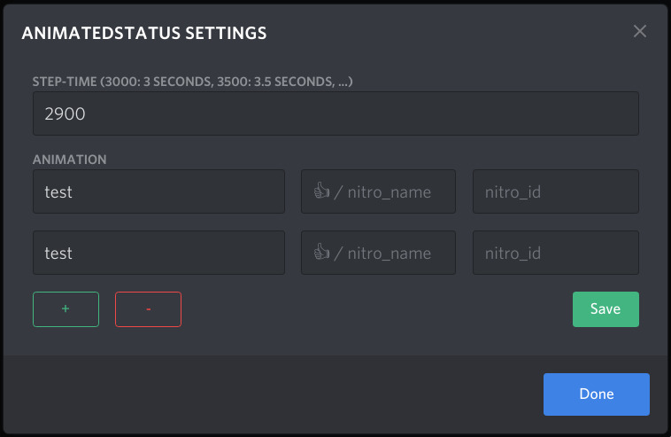
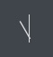
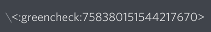
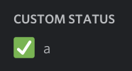
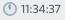

# BetterDiscord-Animated-Status

* [Installation](#Installation)
* [Usage](#Usage)
* [Settings](#Settings)
  * [Timeout](#Timeout)
  * [The Editor](#The-Editor)
  * [Emojis](#Emojis)
    * [Regular Emoji](#Regular-Emoji)
    * [Nitro Emoji](#Nitro-Emoji)
  * [Examples](#Examples)

## Installation
Install using the very convenient [BetterDiscord installer](https://github.com/BetterDiscord/Installer/releases/latest) \
Download [Animated_Status.plugin.js](/Animated_Status.plugin.js?raw=true) into the following directory \
Mac: `~/Library/Preferences/BetterDiscord`\
Windows: `%appdata%\BetterDiscord\plugins`\
Linux: `~/.config/BetterDiscord/plugins`

## Usage
Open Discord, go to Settings\>Plugins, enable AnimatedStatus and click on Settings.\
Enter the required information into the input fields and click the `save` button.
Clicking `done` without saving will discard your settings.

## Settings
<table align=center">
  <td>  </td>
  <td>  </td>
</table>

### Timeout
The value specifies the length of each animation step in milliseconds.
Example: With a timeout of 2000, the following animation would take 4 seconds to complete, as 2 keyframes last 2 seconds each.
```
abc
def
```
To prevent the discord server from being spammed with requests, the minimum allowed timeout is hardcoded to be 2.9 seconds. \
Logically, the animation timeout should be at least `2900`. At best, it should be roughly `10000` milliseconds (10 seconds) for the animation to look smooth on other clients. \
In the mobile app, the status isn't updated consistently, i.e. the list of server members is updated based on the users actions in the app. Don't be surprised, if the animation doesn't appear smooth, or skips frames. \
^ According to [@pintoso](https://github.com/pintoso)

### The Editor
Each cell added with the `+`-button adds a new step to the status animation. \
Clicking the `-`-button will remove the last step. \
An empty cell will unset your status temporarily. This was added due to a request, but is subject to change in the future.

In the latest version, the decision was made to remove the raw editor from the plugin. It was merely an unstable textual interface to the JSON config file. \
**You can still use the RAW-Mode**, by clicking `Open Plugins Folder` inside the settings and editing `AnimatedStatus.config.json`. Do this at your own risk, you might break stuff.

### Emojis
#### Regular Emoji
Use an emoji selector (Windows: <kbd>Win</kbd>+<kbd>.</kbd>). \
Alternatively, use [a unicode table](https://unicode.org/emoji/charts/full-emoji-list.html) and copy the emoji you'd like to have as your status. \
The `emoji_name` field **may not contain whitespace**. Otherwise, the discord server will silently ignore your status request.
Due to uncertainties about nitro emoji names, the plugin does currently not automatically remove whitespace.

#### Nitro Emoji
- Open a discord Chat, type `\`. \
  
- Select the emoji you want to include in your status using the emoji picker. \
  
- Notice that the message changed to `<:emojiname:emojiid>`. The values inside the brackets (emojiname and emojiid) are the values required for the status. \
  
- Edit the settings accordingly \
  

### Examples
Some screenshots are sped up, so the ReadMe looks more appealing.

#### Clock
- **Result:** \
  
- **Emoji-Field:** \
  <code> eval ['🕛','🕐','🕑','🕒','🕓','🕔','🕕','🕖','🕗','🕘','🕙','🕚'][((new Date()).getHours()%12)]; </code>

#### Clock And Text
- **Result:** \
  
- **Emoji-Field:** \
  <code> eval ['🕛','🕐','🕑','🕒','🕓','🕔','🕕','🕖','🕗','🕘','🕙','🕚'][((new Date()).getHours()%12)]; </code>
- **Text-Field:** \
  <code> eval let fmt=t=>(t<10?'0':'')+t;let d=new Date();\`${fmt(d.getHours())}:${fmt(d.getMinutes())}:${fmt(d.getSeconds())}\`; </code>

### TODO (Ignore this)
- Use CSS grid layout for settings window
- Parameterize classes or automatically determine them
